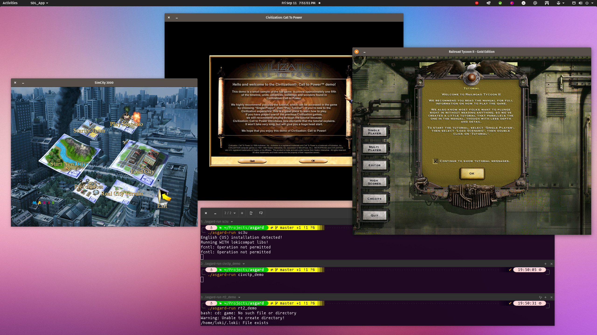

Asgard
======

Run Loki Games and other Linux classic games on modern systems with Docker.

Linux games released in the late nineties were running in a totally different
environment than what a modern Linux system is today. Instead of Wayland, there
was XFree86. Instead of PulseAudio, there was OSS. Instead of being x86_64, the
architecture was i386... glibc, OpenGL, SDL were rudimentary compared to what
they are now. For all those reasons and more, it's either very difficult or
just plain impossible to run old classic Linux games on a modern system.

Despite all those problems, Linux has an excellent binary retro-compatibility.
With tools like Docker, it is possible to recreate an environment friendlier
for old games without requiring virtualization or installing a legacy OS.

Dependencies
------------

- Docker (Tested on the version shipped with Ubuntu 20.04)
- osspd (For games using OSS)

Installing Dependencies on Ubuntu::

  sudo apt install docker.io osspd

Preparing your game
-------------------

Place the fully installed game files in a subfolder in `games`. Name the
subfolder with the name of the game executable (For exemple: `sc3u` for Sim
City 3000, `civctp_demo` for the Call to Power demo)

Build the game image::

    ./asgard-build <game_name>

This will copy the game files to a Docker image and setup the game to run when
bash starts.

Running the game
----------------

After building your game image run::

    ./asgard-run <game_name>

Tested games
------------

The following games have run successfully on Pop!_OS 20.04.

 - Civilization: Call to Power
 - Descent 3
 - Doom 3
 - Heretic 2
 - Heavy Metal FAKK2
 - Jamestown
 - Railroad Tycoon 2
 - Rune
 - Sim City 3000 Unlimited
 - Soldier of Fortune

Credits
-------

Asgard is brought to you by the `Lutris`_ team. All content is under GPL v3.

If you like this project, please consider `supporting the project`_.

.. _Lutris: https://lutris.net
.. _supporting the project: https://patreon.com/lutris
